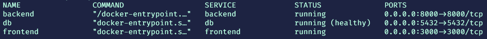
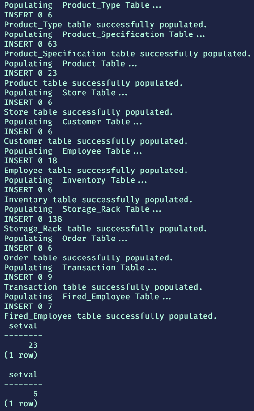
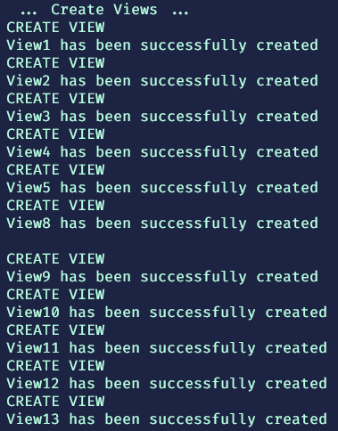

# database-management-project


> :warning: You must have installed docker (version 20.10.10, build b485636), docker-compose (version v2.1.1) and git (version 2.34) on your machine. (https://docs.docker.com/)
 
> if you are on windows10 it is better if you keep Docker Desktop open.

> if you are on ubuntu 20.04 you have to run the script file with sudo otherwise docker and docker-compose will not work

> If this is first time you are cloning this repo and running the project you need to run populate_database.sh and create_database_views.sh shell scripts in order to populate database with data and create the views.

> run these commands one by one on your terminal (linux environment wsl2 or bash).

```bash
~$ git clone https://github.com/ahmetkca/database-management-project.git
~$ cd database-management-project
~$ chmod +x ./run-clean.sh ./populate_database.sh ./create_database_views.sh
~$ ./run-clean.sh               # if on ubuntu 20.04 run with sudo
# once you execute the above command make sure all the services are running and db is healthy
~$ docker-compose ps
# this is what the output should look like if everything is working fine.
```



```bash
~$ ./populate_database.sh       # if on ubuntu 20.04 run with sudo
# the output for the above command should look like below screenshot
```


```bash
~$ ./create_database_views.sh   # if on ubuntu 20.04 run with sudo
# this is what the output should look like if everything is working fine below screenshot.
```



```
Backend (Django Rest Framework) runs on port 8000
Frontend (Svelte) runs on port 3000
Database (PostgreSQL) runs on port 5432
```

> locate to http://localhost:3000 to interact with frontend
